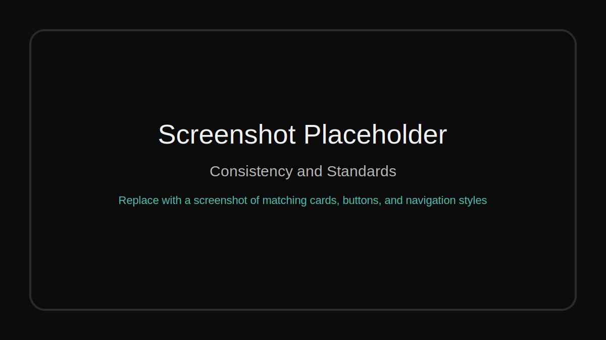
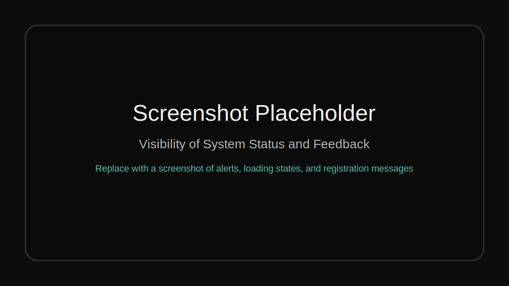
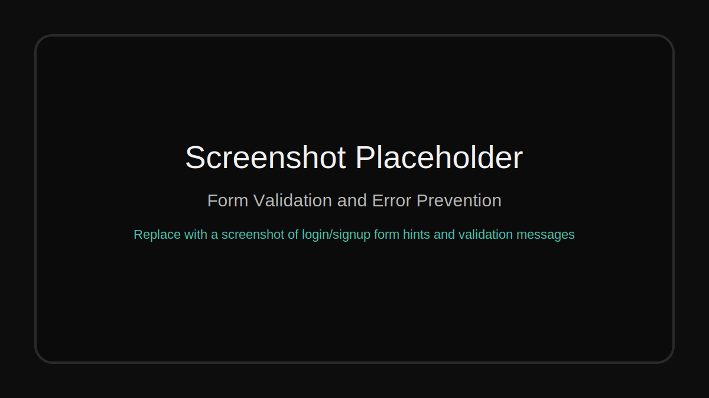
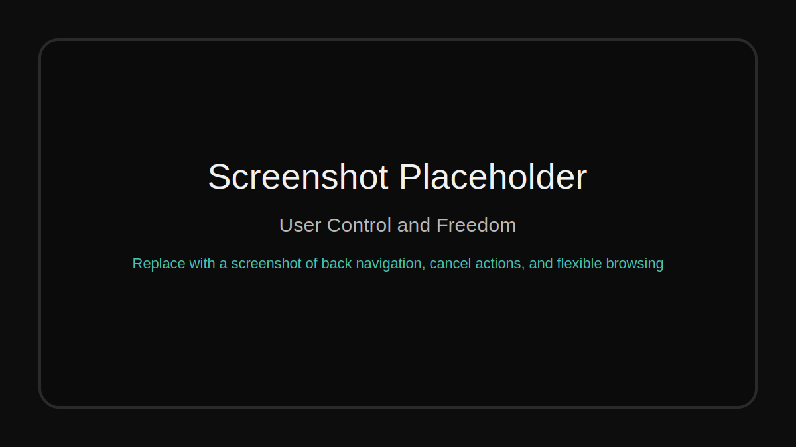
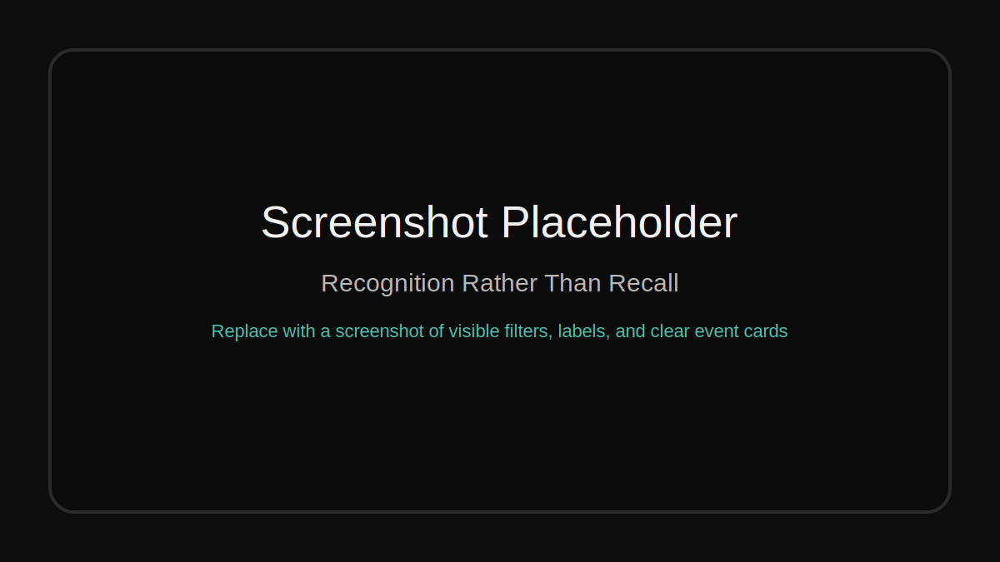
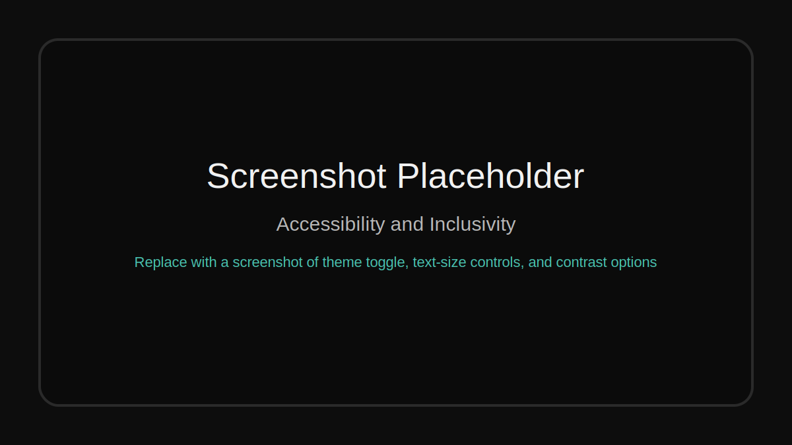
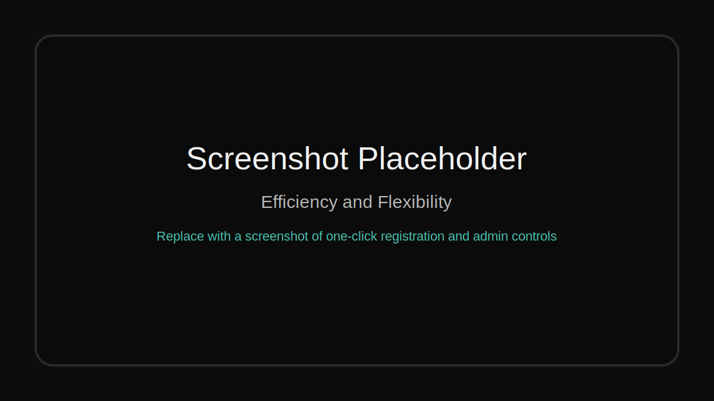
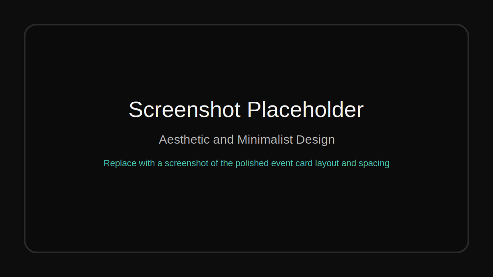

# Eventium HCI Report

This report summarizes the user interface and core functionality of Eventium and maps them to key Human-Computer Interaction principles.

## 1. Consistency and Standards

The app uses a consistent visual language across event cards, buttons, alerts, forms, and navigation. The same button styles and card patterns appear on the home page, event detail page, login page, signup page, reviews page, and admin-facing views. This reduces cognitive load because users learn one interaction pattern and can reuse it everywhere.

## 2. Visibility of System Status and Feedback

Eventium gives immediate feedback through success/error alerts, loading states on forms, registration confirmations, sign-in messages, and review submission messages. Users can see when an action is accepted, rejected, or still processing, which makes the app feel responsive and trustworthy.

## 3. Error Prevention

The forms are designed to reduce mistakes before they happen. Login and signup inputs use hints and validation, review posting only appears for signed-in users, and registration actions are disabled when the event is full or already registered. Password visibility and Caps Lock warnings also help prevent login errors.

## 4. User Control and Freedom

Users can move freely between events, go back to the events list, browse reviews, and leave pages without being trapped in a workflow. The app also supports logout, theme changes, and accessibility controls that users can toggle or reset at any time. This gives the interface flexibility without making it confusing.

## 5. Recognition Rather Than Recall

The interface keeps important options visible instead of hiding them in memory-dependent workflows. Filters are shown as category pills, event details are displayed on the card and detail views, and the reviews page labels entries clearly by event name and username. This makes it easy to understand what is happening without memorizing anything.

## 6. Accessibility and Inclusivity

Accessibility is treated as a first-class feature through the floating accessibility control, dark mode, high contrast mode, bold text, and text-size adjustments. The review and login/signup forms also use clear labels, focus states, and readable color contrast so the interface can work for more users.

## 7. Efficiency and Flexibility

The app is efficient because users can register for events directly from the listing or event detail page, browse reviews without needing an account, and access admin tools when signed in as staff. Pagination and filters keep longer event lists manageable, while the admin button appears only for users who need it.

## 8. Aesthetic and Minimalist Design

Eventium uses a clean layout with strong spacing, simple card structures, and a premium dark theme that keeps attention on the content. The UI avoids unnecessary clutter, and the event imagery, badges, and compact controls make the pages readable while still feeling polished.

## Summary

Eventium aligns well with common HCI principles because it is consistent, gives feedback, prevents errors, supports accessibility, and keeps the interface simple. The app is especially strong as a presentation project because the core actions are easy to discover and the visual design feels intentional.
